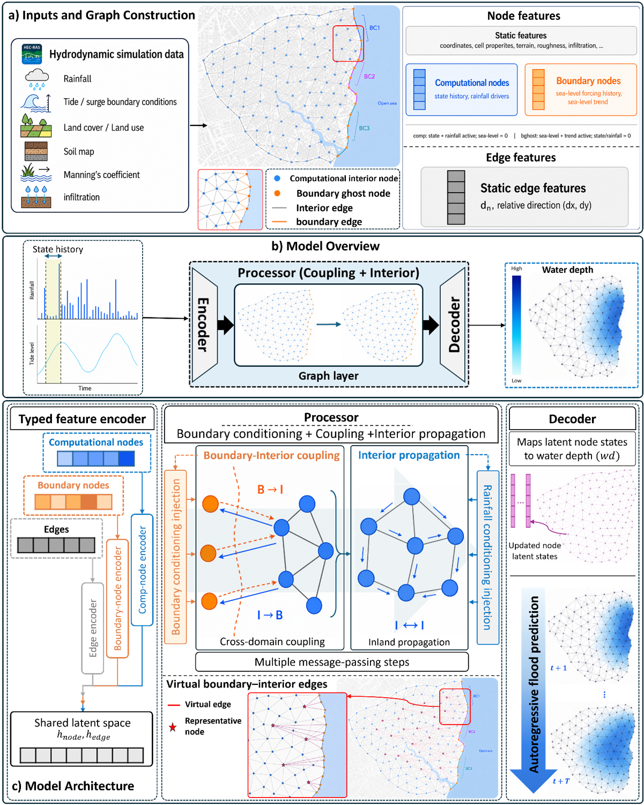

# Boundary-Aware Graph Neural Networks for Compound Flood Forecasting

## Description

Compound flooding arises from nonlinear interactions among rainfall-driven runoff, coastal water-level forcing, riverine response, and the hydraulic pathways that transfer these forcings through low-lying coastal floodplains. GNN4CF is a boundary-aware graph neural network surrogate designed to predict compound-flood water-depth evolution on unstructured hydraulic meshes while preserving the physical distinction between external boundary forcing and interior floodplain propagation.

The framework represents the hydraulic mesh as a typed graph with separate coastal boundary and interior computational nodes. A dedicated boundary-interior coupling processor transfers coastal-stage information into the floodplain, while a separate interior processor propagates the hydraulic response through the computational domain. Virtual boundary-to-interior edges support long-range coastal signal transfer under finite message-passing depth, and repeated rainfall and coastal-stage conditioning preserves time-varying forcing information during autoregressive rollout.

Across held-out events, GNN4CF reduces RMSE, relative L2 error, and false alarm ratio while improving inundation-detection skill relative to ablated graph models. The model also achieves rapid GPU inference and generalizes from single-active-boundary training events to unseen simultaneous multi-boundary forcing configurations, indicating that learned boundary-response pathways can be recombined under more complex coastal-connectivity states. The proposed framework is summarized in the figure below.

## Proposed Framework



## Highlights

- GNN4CF enables rapid, spatially distributed compound-flood forecasting and generalizes to unseen multi-boundary forcing.
- Dual processors outperform shared message passing by separating boundary exchange from interior propagation in boundary-driven PDE surrogates.
- Dynamic forcing conditioning preserves time-varying inputs in autoregressive PDE surrogates, while virtual edges enhance long-range propagation.

## Supplementary Animations

Supplementary animations illustrating autoregressive rollout predictions for representative compound-flood events are available through the following Google Drive folder:

[Reviewer supplementary animations](https://drive.google.com/drive/folders/1HcZCrWNIrm8h0ekQw5B9Z_MB6RL6o7XS?usp=sharing)

The single-boundary animations compare M1-M4 and the single-processor model, showing how successive architectural components affect spatial flood evolution, frame-wise error, inundation agreement, and relative L2 behavior. The multi-boundary animations show GNN4CF across simultaneous coastal-boundary combinations, including BC12, BC13, BC23, and BC123, to illustrate generalization to unseen compound boundary-forcing configurations. Animations are provided for both 0.10 m and 0.20 m wet-depth thresholds.

## Citation

If you use this repository, code, figures, or concepts from GNN4CF in your research, please cite the manuscript:

**Zandsalimi, Z.**, Taghizadeh, M., Shafiee-Jood, M., and Alemazkoor, N. (2026). **Boundary-Aware Graph Neural Networks for Compound Flood Forecasting.** *Water Resources Research*. Under review.

```bibtex
@article{zandsalimi2026gnn4cf,
  title = {Boundary-Aware Graph Neural Networks for Compound Flood Forecasting},
  author = {Zandsalimi, Zanko and Taghizadeh, Mehdi and Shafiee-Jood, Majid and Alemazkoor, Negin},
  journal = {Water Resources Research},
  year = {2026},
  note = {Under review}
}
```

## Repository Status

This repository is being prepared for manuscript review. Code, model-configuration files, and reproducibility materials will be added upon publication.
